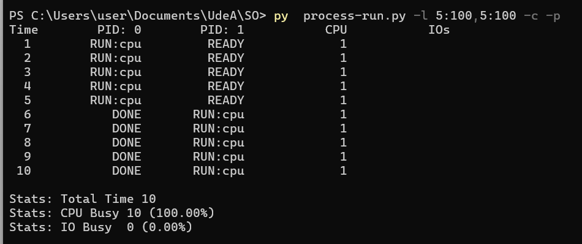

# Actividad de seguimiento - Simulación 1

|Integrante|correo|usuario github|
|---|---|---|
|Ana Maria Vega Angarita|ana.vega@udea.edu.co|anavegaa|
|Juan Diego Calderon Bermeo|juand.calderon@udea.edu.co|juandcalderon16|

## Instrucciones

Antes de empezar a realizar esta actividad haga un **fork** de este repositorio y sobre este trabaje en la solución de las preguntas planteadas en la actividad de simulación. Las respuestas deben ser respondidas en español o si lo prefiere en ingles en el lugar señalado para ello (La palabra **answer** muestra donde).

**Importante**:
* Como la actividad es en las parejas del laboratorio, solo uno de los integrantes tiene que hacer el fork; y sobre repositorio bifurcado que se genera, la modificación se realiza en equipo.
* Como la entrega se debe hacer modificando el archivo READNE, se recomienda que consulte mas sobre el lenguaje **Markdown**. En el repo adjuntan dos cheatsheet ([cheat sheet 1](Markdown_Cheat_Sheet.pdf), [cheatsheet 2](markdown-cheatsheet.pdf)) para consulta rapida.
* Entre mas creativo mejor.

## Homework (Simulation)

This program, [`process-run.py`](process-run.py), allows you to see how process states change as programs run and either use the CPU (e.g., perform an add instruction) or do I/O (e.g., send a request to a disk and wait for it to complete). See the [README](https://github.com/remzi-arpacidusseau/ostep-homework/blob/master/cpu-intro/README.md) for details.

### Questions

1. Run `process-run.py` with the following flags: `-l 5:100,5:100`. What should the CPU utilization be (e.g., the percent of time the CPU is in use?) Why do you know this? Use the `-c` and `-p` flags to see if you were right.
   

**```🟢 La utilizacion de la CPU debe ser del 100% porque en la parte derecha de las flags nos dice el porcentaje de CPU que se va a utilizar.```**

<p align="center">
  
</p>


   <br>

3. Now run with these flags: `./process-run.py -l 4:100,1:0`. These flags specify one process with 4 instructions (all to use the CPU), and one that simply issues an I/O and waits for it to be done. How long does it take to complete both processes? Use `-c` and `-p` to find out if you were right. 
   

**```🟢 Ambos procesos tardan 11 unidades de tiempo en total, ya que como el primero usa el 100% de la CPU tarda 4 unidades de tiempo y el segundo tarda 7 unidades de tiempo (2 unidades de tiempo con I/O y 5 unidades de tiempo bloqueado).```**
   
   <br>

4. Switch the order of the processes: `-l 1:0,4:100`. What happens now? Does switching the order matter? Why? (As always, use `-c` and `-p` to see if you were right)
   
**```🟢 Al cambiar el orden de los procesos toma menos tiempo, 7 unidades de tiempo en total. Si importa el orden, porque al entrar primero el proceso que se va a bloquear, la CPU al momento de bloquearlo sigue con el siguiente proceso mientras el primero sigue bloqueado las mismas 5 unidades de tiempo.```**
   <br>

5. We'll now explore some of the other flags. One important flag is `-S`, which determines how the system reacts when a process issues an I/O. With the flag set to SWITCH ON END, the system will NOT switch to another process while one is doing I/O, instead waiting until the process is completely finished. What happens when you run the following two processes (`-l 1:0,4:100 -c -S SWITCH ON END`), one doing I/O and the other doing CPU work?
   
**```🟢 Al ejecutar con SWITCH ON END, cuando un proceso se bloquea, a diferencia del anterior ejercicio, la CPU no va a iniciar otro proceso hasta finalizar en el que está, entonces al entrar la primera instrucción se va a demorar las mismas 7 unidades de tiempo en I/O bloqueado y despues entra el siguiente proceso para completar las 11 unidades de tiempo. Por lo tanto, es mas eficiente si no se utiliza SWITCH ON END.```**
   <br>

6. Now, run the same processes, but with the switching behavior set to switch to another process whenever one is WAITING for I/O (`-l 1:0,4:100 -c -S SWITCH ON IO`). What happens now? Use `-c` and `-p` to confirm that you are right.
   
**```🟢 Toma menos unidades de tiempo, ya que esta configurado para que empiece un proceso mientras el otro esta esperando en I/O.```**
   <br>

7. One other important behavior is what to do when an I/O completes. With `-I IO RUN LATER`, when an I/O completes, the process that issued it is not necessarily run right away; rather, whatever was running at the time keeps running. What happens when you run this combination of processes? (`./process-run.py -l 3:0,5:100,5:100,5:100 -S SWITCH ON IO -c -p -I IO RUN LATER`) Are system resources being effectively utilized?
   
**```🟢 No se utilizan eficazmente los recursos del sistema, ya que al terminar el segundo proceso, lo más eficiente sería que intentara el primero para que al momento de bloquearse otra vez siguiera con el tercero y así sucesivamente para que al final tarde menos unidades de tiempo. En total tomó 31 unidades de tiempo.```**
   <br>

8. Now run the same processes, but with `-I IO RUN IMMEDIATE` set, which immediately runs the process that issued the I/O. How does this behavior differ? Why might running a process that just completed an I/O again be a good idea?
   
**```🟢 Porque como se explicó anteriormente, al momento de volver a intentar el proceso de I/O, se vuelve a bloquear y continua con el siguiente, eso hace que se reduzca el tiempo, ya que no deja los procesos I/O para el final. Y como se ve en la imagen, tarde 21 unidades de tiempo en total, 10 menos que en el anterior.```**
   <br>


### Criterios de evaluación
- [x] Despligue de los resultados y analisis claro de los resultados respecto a lo visto en la teoria.
- [x] Creatividad y orden.
